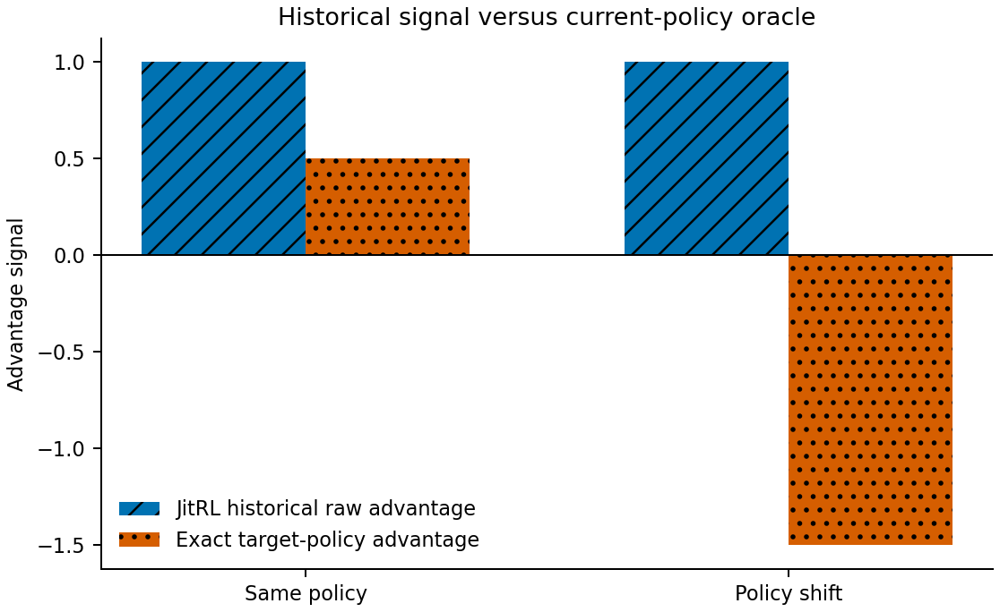
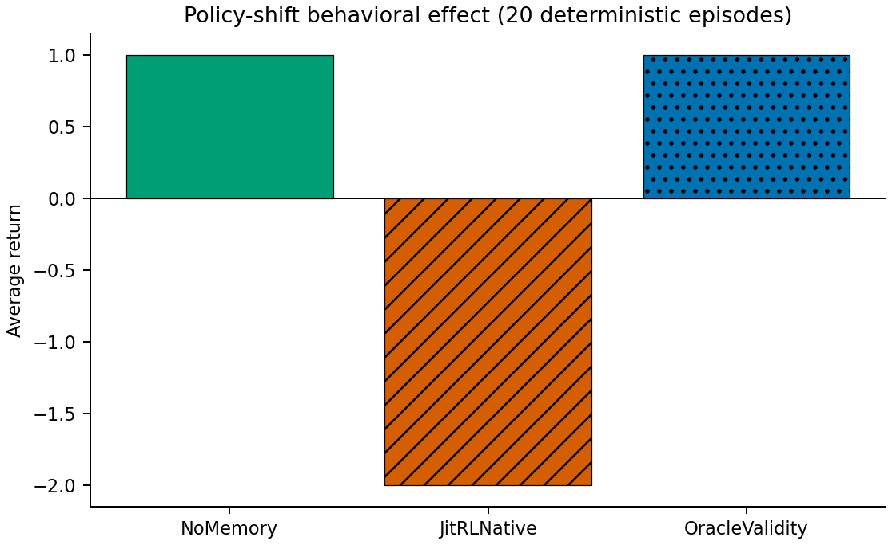

# Idea 2 Stage-8 实验结果

## 1. 研究问题

本轮检验 Stage-7 的 policy-relative value reversal 能否通过 JitRL 的真实
memory → retrieval → historical advantage → current score 路径，形成可观察的
source-policy / target-policy 信号冲突与行为损失。结论范围仅是最小确定性复现。

## 2. JitRL source/version

使用项目内已有上游 checkout：

- 路径：`idea_validation/idea2_policy_conditioned_memory_audit/third_party/jitrl`
- remote：`https://github.com/liushiliushi/JitRL.git`
- commit：`143d22185d95fbf633a0befe6861d5e8b732543b`
- 主审计实现：`WebArena`
- 两个受审计 tracked source 的 SHA256 与预注册一致且无 tracked diff。

Stage-8 前已存在的 `Jericho/src/__pycache__/*.pyc` 不属于源码，本轮未使用或修改。

## 3. Native mechanism mapping

原生链条如下：

1. `add_episode` 写入 episode 和逐步 state/action/reward/score/`llm_step_score`；
2. `_store_step_in_vector_db` 建立逐步 retrieval metadata 和未来 step-score 序列；
3. `retrieve_similar_with_vector` 先匹配 normalized URL，再按 task/history
   unigram Jaccard 计算 `0.7 * history + 0.3 * task` 并做阈值过滤；
4. 检索时计算 `discounted_reward`；
5. `update_scores` 按 normalized action 聚合平均历史回报，减 overall mean 得到
   raw advantage，再归一化；
6. 原生更新为
   `corrected_logprob = normalized_prob + normalized_advantage`；
7. `generate_action` 选择 corrected score 最大的动作。

本轮不是另写一个 JitRL-like 公式。adapter 从固定上游源码抽取并执行上述
`_store_step_in_vector_db`、`retrieve_similar_with_vector` 和
`update_scores` 的原始 AST 函数体。只替换了依赖完整 LLM/runtime 的文本摘要输入，
并对已经规范化的 toy action 使用 identity normalization。

## 4. Source-policy provenance audit

结论为 **PARTIAL**。存储路径含 game/agent type/model slug，memory metadata 含
episode number/timestamp，因此有粗粒度模型与时间顺序信息；但逐条 experience 不含
behavior policy、prompt/policy snapshot、checkpoint、policy version、propensity 或
policy-era 标识。它不能把某个 historical return 绑定到生成它的完整 source policy。

## 5. Revaluation/correction audit

没有发现 policy 改变后按当前 continuation policy 重新估计历史动作价值的实现。
检索阶段会用当前配置 gamma 对固定 future step scores 再折扣，但不会计算
`Q^{pi_t}`。审计路径中也没有 importance weighting、behavior/target-policy
correction、source-target policy comparison、provenance-aware rejection 或
off-policy validity test。

相似性阈值回答“过去上下文是否像当前上下文”；reward stability/sample count 或
LLM confidence 回答“历史/当前分数看起来是否稳定”。它们不回答“该动作信号对当前
continuation policy 是否仍有效”。

## 6. Stage-8A verdict

**JITRL_MAPPING_GO**

A0–A6 全部 PASS：真实 storage、retrieval、historical value/advantage 和当前动作影响
链条完整，且未发现显式 current-policy validity correction。

## 7. B1 same-policy

source=`pi_A`，target=`pi_A`。同一历史 successful memory 被原生 retriever
检索，similarity=1，historical return=+2，native normalized signal=+1。
当前 exact target Q(`a_L`)=+2，target advantage=+0.5，符号一致。原生 bias
没有改变 base action，最终选择 `a_L`，return=+2，regret=0。same-policy sanity PASS。

## 8. B2 policy-shift mismatch

source=`pi_A`，target=`pi_B`。完全相同的 native memory 仍被检索并产生
historical return=+2、raw advantage=+1、normalized signal=+1。当前 exact
target Q(`a_L`)=-2，target advantage=-1.5。

`pi_B` base scores 为 `a_L=0, a_R=1`；原生修正后变为
`a_L=1, a_R=0`，动作从 `a_R` 改为 `a_L`。因此：

- retrieved：true
- positive historical / negative target：true
- sign mismatch：true
- harmful policy bias：true
- chosen return：-2
- per-episode regret：3

**POLICY_RELATIVE_SIGNAL_MISMATCH：PASS**

图中蓝色斜线柱为 JitRL 原生 raw historical advantage，橙色点纹柱为 exact
target-policy advantage；policy-shift 条件下两者跨越零线、方向相反。源数据为
`results/advantage_mismatch.csv`。

## 9. B3 behavioral effect

在 `pi_A → pi_B` 下每个 baseline 固定运行 20 个确定性 episode：

| Baseline | Average return | Cumulative regret | Harmful-memory-use rate | Harmful-policy-bias rate |
|---|---:|---:|---:|---:|
| NoMemory | +1 | 0 | 0 | 0 |
| JitRLNative | -2 | 60 | 1 | 1 |
| OracleValidity | +1 | 0 | 0 | 0 |

NoMemory 使用冻结 `pi_B`，没有读取 memory；JitRLNative 不读取 oracle Q；
OracleValidity 是唯一在决策前读取 current-policy exact Q 的诊断上界。Oracle 不代表
可部署方法。B3 behavioral harm PASS。

图中比较三个 baseline 的 20 个确定性 episode 平均回报；底层逐 episode 数据在
`results/baseline_results.csv`。

## 10. B4 closed-loop

**NOT_TESTABLE**。允许的 no-LLM source-extracted harness 已执行原生存储、检索、
advantage 与 score correction；但上游 episode scoring/trajectory text generation
依赖本轮明确禁止的 LLM runtime，且该代码没有可单独调用的 native policy-update
规则。为避免虚构更新规则，本轮不运行闭环，不报告 validity flip，也不生成
`mismatch_over_time.png`。因此没有 native closed-loop evidence。

## 11. Gates

| Gate | Result |
|---|---|
| G0 Integrity | PASS |
| G1 Native Mapping | PASS |
| G2 No Explicit Validity Correction | PASS |
| G3 Same-policy Sanity | PASS |
| G4 Policy-shift Signal Mismatch | PASS |
| G5 Behavioral Harm | PASS |
| G6 Native Fidelity | PASS |
| G7 Beyond Static Q Fact | PASS |
| G8 Closed-loop Evidence | NOT_TESTABLE |

23 项正式前测试通过；预注册与 formal Python 文件 SHA256 锁定；唯一一次 formal run
完成，无 restart；未调用 LLM/API，未运行完整 JitRL benchmark。

## 12. 与经典 OPE / policy-dependent Q 的关系

`Q^pi` 随 continuation policy 改变是经典事实，Stage-7 已给出 +2→-2 的 exact
counterexample。本轮额外证据是：JitRL 的实际 per-step memory 被实际检索函数取回，
其固定 historical step-score return 经实际 `update_scores` 转成正 advantage，并
重新注入当前候选分数；在 `pi_B` 下它改变动作并产生可测回报下降。这把静态 Q 事实
映射到了一个真实 Agent Memory 代码路径，但没有提出新的 RL/OPE 理论。

## 13. Limitations

- Stage-8B 仍是 toy deterministic MDP。
- 不是完整 LLM agent、WebArena 或 Jericho benchmark。
- adapter 执行上游核心 AST 函数体，但用预物化文本替代 LLM trajectory summarizer，
  并把 deterministic step rewards `[0,+2]` 填入原生 `llm_step_score` schema。
- base option scores 是冻结 deterministic policy 的 one-hot 表示，不是实测 LLM logits。
- 固定 seed=0 走 native 0.05 exploration 的非探索分支；未做跨 seed 频率估计。
- Oracle target signal 使用环境真值，不能直接用于真实部署。
- 只验证 JitRL 一个系统和一个固定 commit。
- 未证明所有 Agent Memory 都有此问题。
- 未证明真实自然任务中的发生频率。
- 未设计解决方法。
- 未证明论文 novelty。
- 未证明 long-run instability。
- G8 为 NOT_TESTABLE；没有 native closed-loop evidence。
- WebArena 的 active retriever 当前未执行源码中已注释的 top-k 截断；本结论绑定该固定
  commit 的实际行为。
- 结果不支持“JitRL 有严重 bug”或“JitRL 错误”的表述。

## 14. Final verdict

**JITRL_NATIVE_FAILURE_GO**

受限结论：Stage-7 的 policy-relative memory validity failure 可以映射到 JitRL
固定 commit 的原生 memory→retrieval→historical advantage→current action 路径，
并在最小受控复现中产生历史信号与当前 policy value 的可观察 mismatch 和行为损失。
因为 G8 NOT_TESTABLE，结论不包含 native closed-loop 或长期不稳定性证据。
